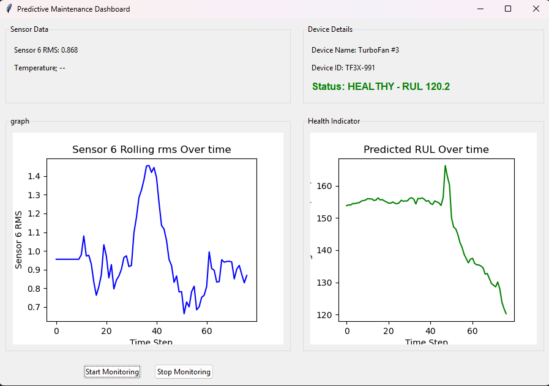
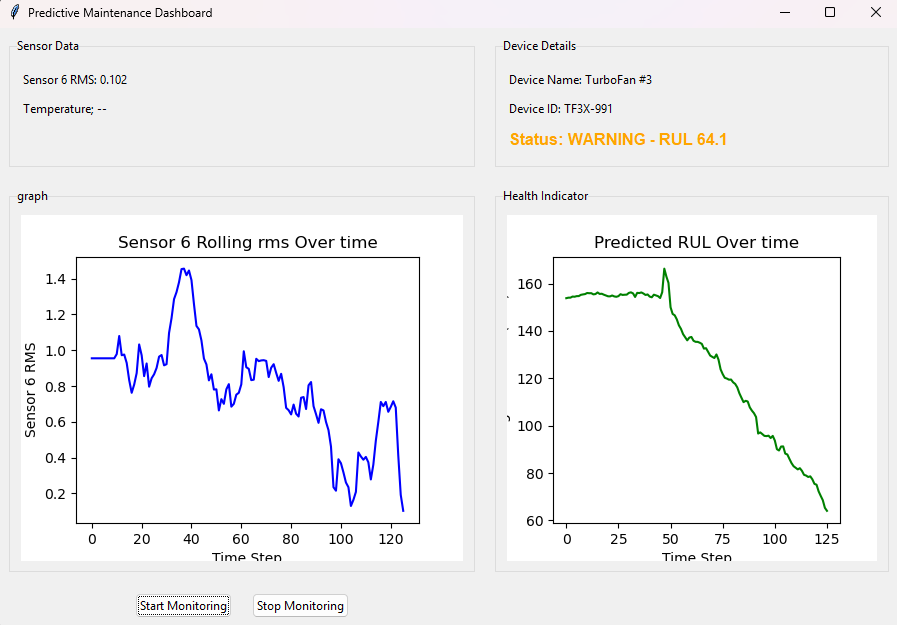
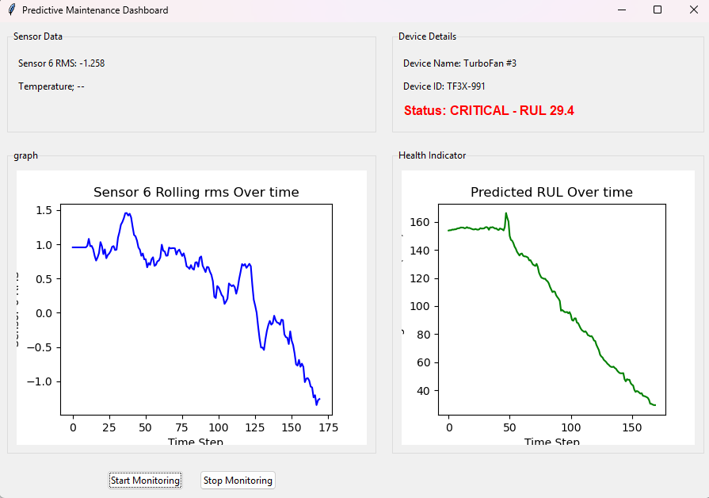

<div align="center">
    <h1>ManuSenseAI</h1>
</div>

**ManuSenseAI** is a desktop-based Predictive Maintenance solution built with **Python** and **Tkinter**, designed to monitor machine health and forecast Remaining Useful Life (RUL) using **Machine Learning** models. It is built using NASA's Turbofan Engine Degradation Simulation Dataset, but is easily customizable for **any company's proprietary machinery or sensor data**.

<div align="center">
  
  
  
</div>

---

## 🧠 Key Features

- 📊 **Remaining Useful Life Prediction**  
  Predict how much time a machine component has before failure using regression models.

- 🛑 **Danger Zone Detection**  
  Real-time alerts when the machine's health reaches critical thresholds.

- 🧱 **Built with Tkinter GUI**  
  User-friendly and lightweight graphical interface, ideal for operators and engineers.

- 🛠️ **Easily Customizable for Any Machine**  
  Tailor the tool to fit your company's specific device or system by adjusting the input schema.

- 📁 **Industrial Dataset-Backed**  
  Trained and tested on NASA’s CMAPSS Turbofan Engine Degradation Dataset.

---

## 📷 UI Preview





---

## 🛠️ Tech Stack

| Component        | Description                                 |
|------------------|---------------------------------------------|
| 🐍 Python        | Core programming language                   |
| 🎨 Tkinter       | GUI for user interaction                    |
| 🤖 Scikit-learn  | ML model training and prediction            |
| 📈 Pandas, Numpy | Data preprocessing and manipulation         |
| 📊 Matplotlib    | (Optional) Visualize sensor data trends     |

---

## 🧪 How It Works

1. 📥 **Load Sensor Data**  
   Import time-series data from machinery sensors.

2. 🧹 **Preprocess Data**  
   Handle scaling, feature extraction, and windowing.

3. 🤖 **Predict RUL**  
   ML model (e.g., Random Forest, Gradient Boosting) predicts the component’s RUL.

4. 🚨 **Indicate Danger Level**  
   Visual warning system indicates if RUL is approaching failure threshold.

5. 🔁 **Customize Input Features**  
   Modify feature columns and thresholds to suit your specific machine/device.

---

## 🚀 Getting Started

### 🔧 Installation

```bash
git clone https://github.com/yourusername/ManuSenseAI.git
cd ManuSenseAI
python main.py
